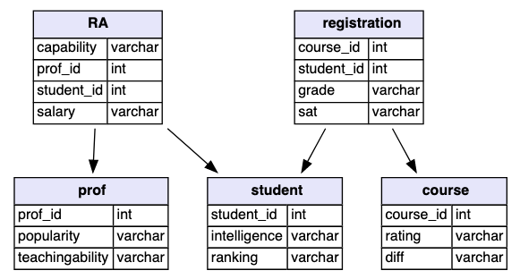

# SQL Join - INNER JOIN

[◀ _previous_](https://github.com/fegvilela/til/blob/main/sql/07-grouping.md) | [ _next_ ▶️ ](https://github.com/fegvilela/til/blob/main/sql/09-self-join.md)| [ 🏠 ](https://github.com/fegvilela/til/tree/main/sql)

Essa operação serve para "juntar" tabelas, baseando-se em um ou mais "valores-chave" que relacionam as tabelas.

Vamos usar essa estrutura de dados relacional para os exemplos.



## Com uma tabela

```sql
SELECT prof_id, popularity, salary
FROM prof AS p
INNER JOIN RA AS r
ON p.prof_id = r.prof_id
```

- É uma _boa prática_ usar **alias** para todas as tabelas quando usamos `INNER JOIN`, sendo a primeira letra do nome da tabela. Ex. `prof AS p`

Nos casos em que temos o valor-chave com nome igual em ambas tabelas, podemos usar `USING`

ao invés de `ON`

```sql
SELECT prof_id, popularity, salary
FROM prof AS p
INNER JOIN RA AS r
USING (prof_id);
```

## Com múltiplas tabelas

```sql
SELECT intelligence, diff AS course_difficulty, r.grade
FROM registration AS r
INNER JOIN student AS s
USING (student_id)
INNER JOIN course AS c
USING (course_id);

```

- Quando temos **mais do que um valor-chave** entre as tabelas e estamos trabalhando com `INNER JOIN` de múltiplas tabelas, precisamos usar `ON` com todos esses valores-chave.

---

_66 days of data (9/66)_ \
https://campus.datacamp.com/courses/joining-data-in-postgresql/introduction-to-joins?ex=1

---

[◀ _previous_](https://github.com/fegvilela/til/blob/main/sql/07-grouping.md) | [ _next_ ▶️ ](https://github.com/fegvilela/til/blob/main/sql/09-self-join.md)| [ 🏠 ](https://github.com/fegvilela/til/tree/main/sql)
